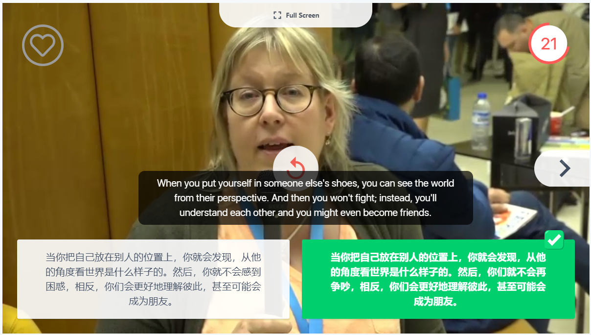
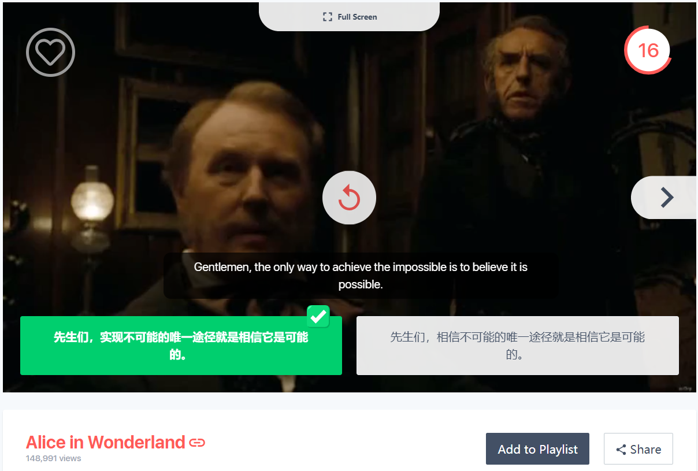

# learnEnglish
Materials for Learning English by listening, repeating and speaking everyday

## Recommendation
 - [Voscreen](https://www.voscreen.com)  
 强烈推荐，非常有趣！听多了，就会不自觉的尝试把听到的句子复述出来。（一周时间，从0分到8570分，排名从90万+到6万+）
 - app：轻听英语（原名：朗思易听）  
 资源非常全
 - [TED](https://www.ted.com/talks) or [网易公开课](https://open.163.com/)   
 资源丰富，听自己选择感兴趣的话题
 - [Understanding IELTS: Techniques for English Language Tests](https://www.futurelearn.com/courses/understanding-ielts?utm_source=BC_China_website&utm_medium=web&utm_campaign=Understanding_IELTS12_Feb19)  
 了解雅思，听说读写

 ## Study Record
 |资源|描述|笔记|
 |-|-|-|
 |[Steve Job's Commencement Speech at Stanford](http://open.163.com/movie/2006/8/3/8/M7BC8JMHJ_M7BC8PA38.html)|乔布斯在斯坦福毕业典礼上的演讲| 听了N遍(整段&分段)，非常好的听力材料，内容也非常棒。 1. The heaviness of being successful was replaced by the lightness of being a beginner again.  2. Keep looking, don't settle.  3. Your time is limited, so don't waste it living someone else's life. Don't let the noise of other's opinions drown out your own inner voice. And most important, have the courage to follow your heart and intuition. They somehow already know what you truly want to become. Everything else is secondary.  4. Stay hungury, Stay foolish.|
 |[Dan Gilbert：The surprising science of happiness](https://www.ted.com/talks/dan_gilbert_asks_why_are_we_happy)|TED Talk Year2004||
 |how.i.met.your.mother.s01e01|老爸老妈浪漫史第一季第一集|盲听>>看字幕听>>盲听>>反复听 英文字幕资源的Timeline有问题，Solution：中文字幕的Timeline + 英文字幕，用Python脚本完成这种形式的合成☺|
 

 ## Vocabulary Notebook
 [Vocabulary_Notebook.md](./resource/vocab_notebook.md)

 ## Voscreen screenshot
 
 
